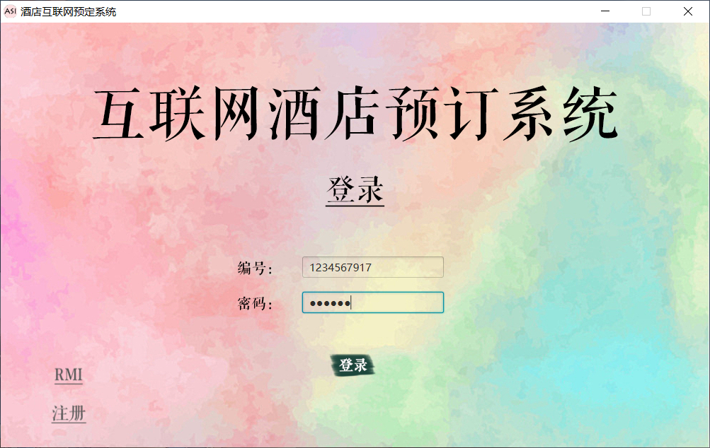
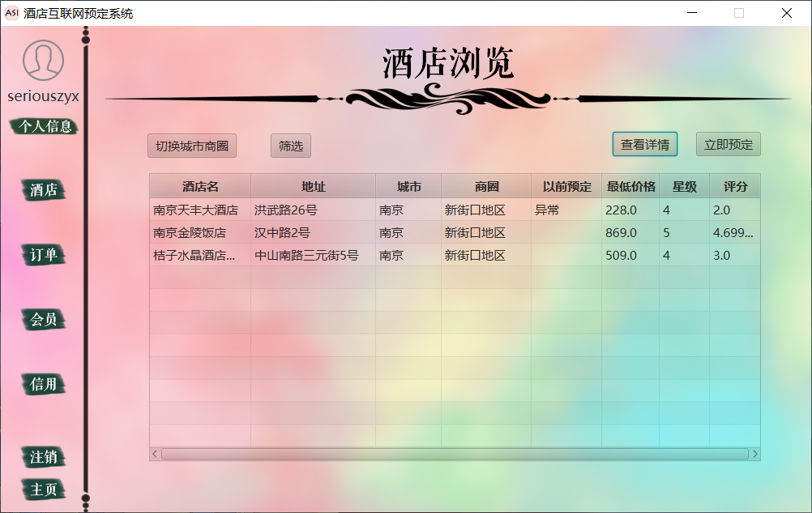
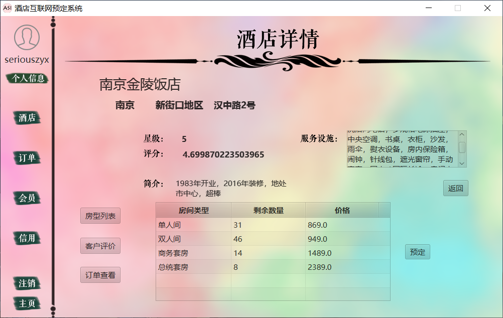
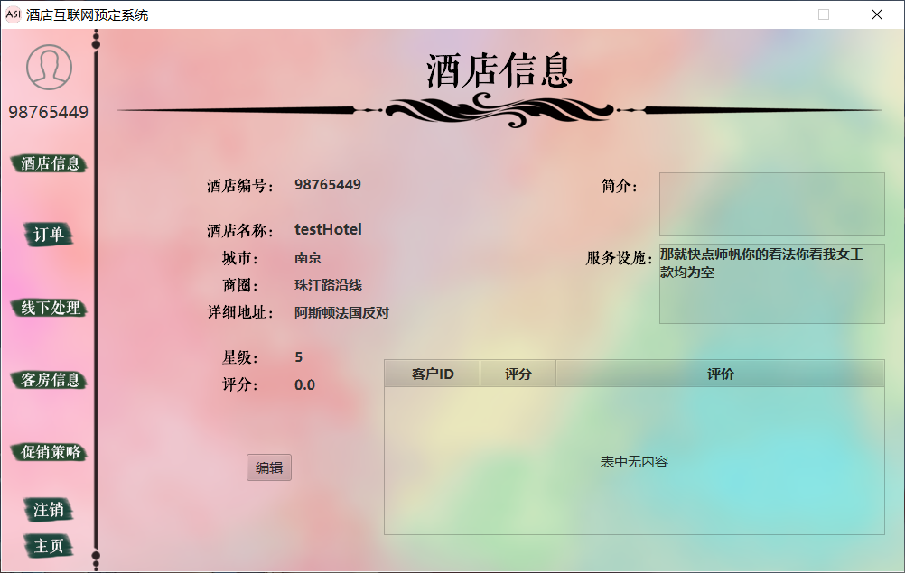
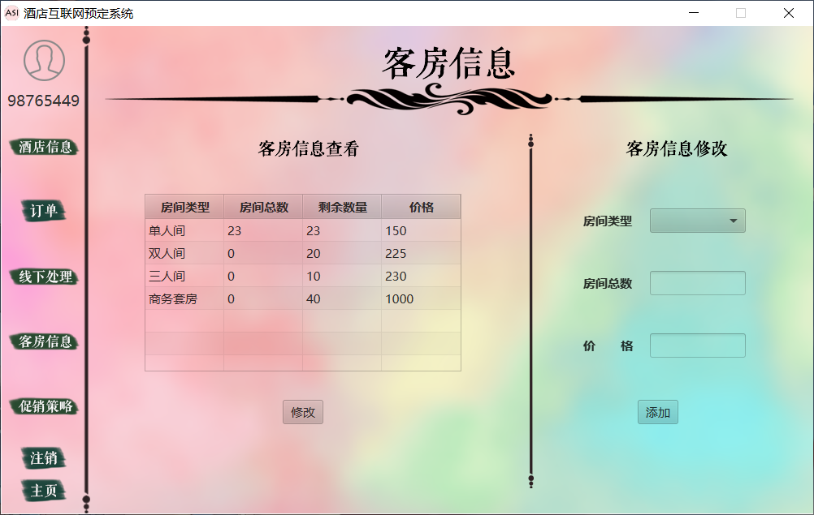
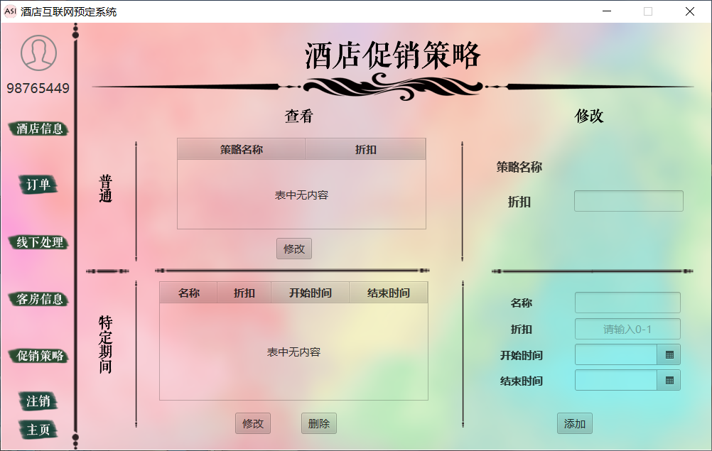
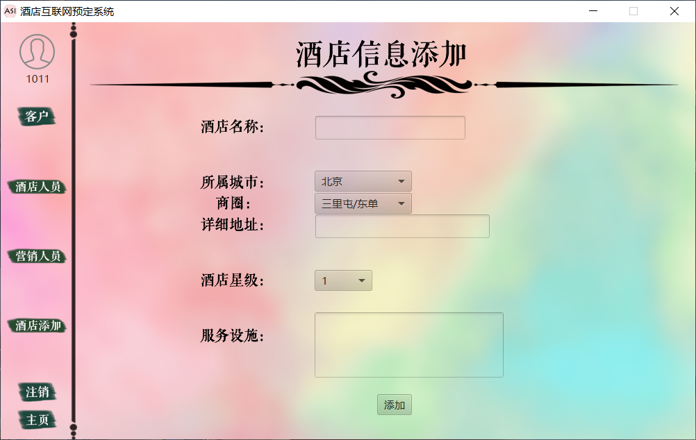
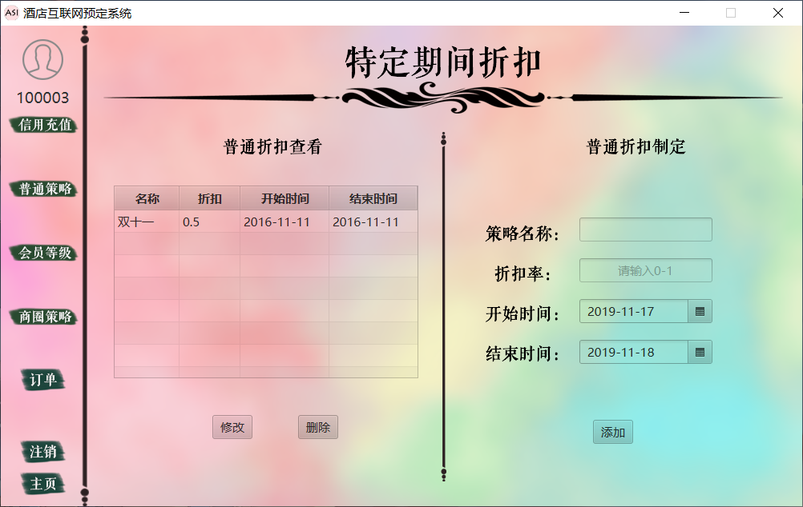
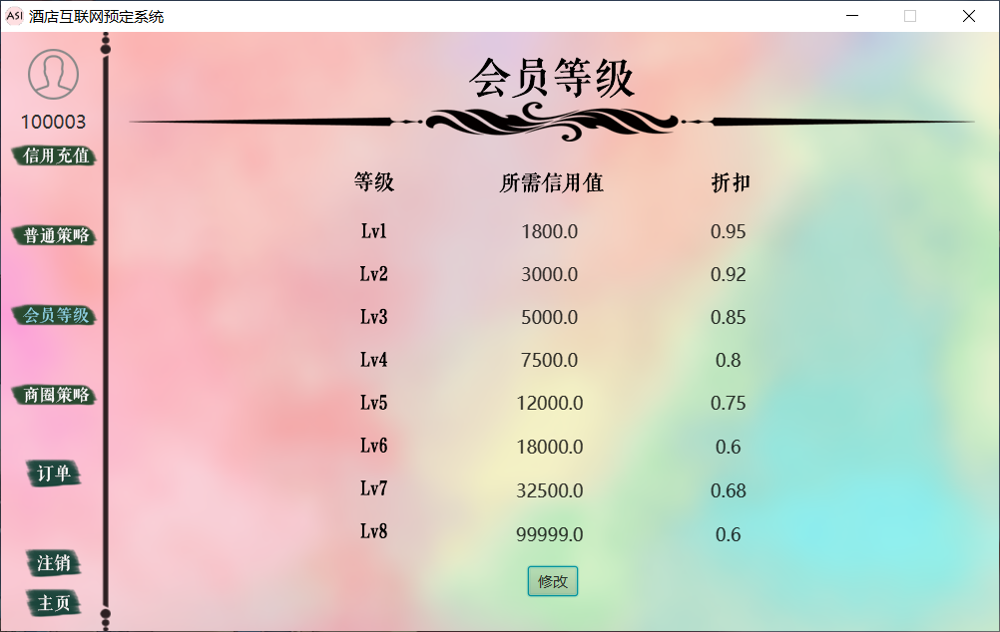

# 软件工程课程设计

## 酒店管理系统

使用 java 设计并实现 PC 端酒店管理系统。

### 系统介绍

酒店管理系统是为酒店及其客户开发的业务平台，开发的目标是用于帮助客户预订酒店，包括选择酒店、提交订单和撤销订单；以及帮助酒店处理预订业务，包括接受客户预订、执行客户订单和活动促销。

通过酒店管理系统的应用，期望防范恶意预订、提高酒店的房间利用效率、为酒店吸引回头客并提高客户的满意度、提高酒店销售额和利润。

### 用例图

### 时序图示例

### 全局类图

### 软件示例功能截图

- 普通用户

- 酒店管理人员

- 软件营销人员

- 软件管理人员

